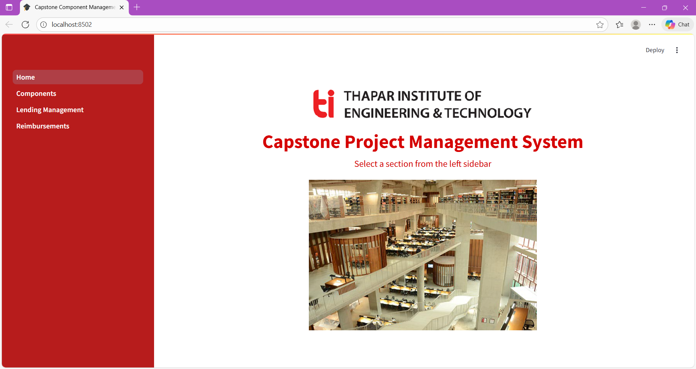
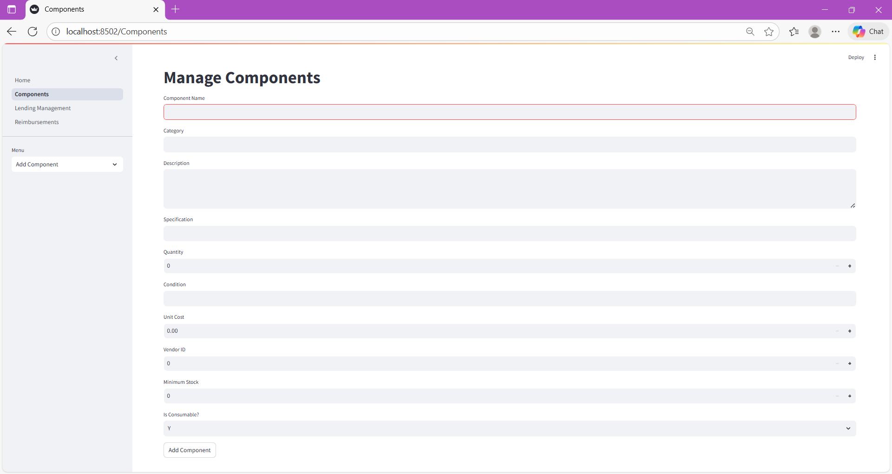
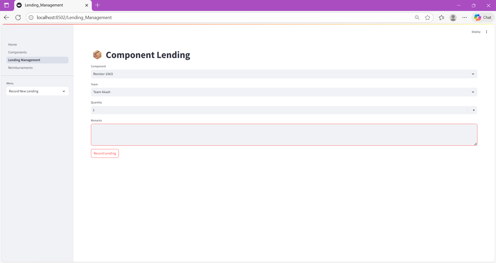
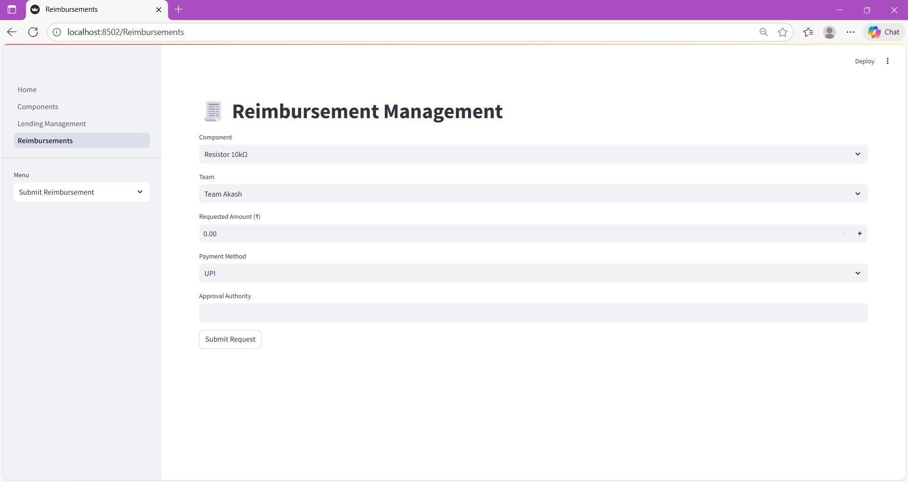

# Capstone Component Management Portal

A simple but powerful web-based management system for tracking components, inventory, lending, and reimbursements — ideal for academic labs, project teams, and capstone projects.

---

## What the Project Does

- Maintain a **components inventory** (add, view, track stock)  
- Record **component lending/borrowing** for teams  
- Manage **reimbursements** and payments for components or supplies  
- Organize **teams, students, suppliers**  
- Provide a clean, user-friendly **web interface** via Streamlit + MySQL  

---

## Technologies Used

| Layer         | Technology           |
|--------------|----------------------|
| Frontend     | Streamlit (Python)   |
| Backend      | Python + MySQL       |
| Database     | MySQL / MySQL Workbench |
| Hosting / Version Control | GitHub           |

---

## Repository Structure
**Capstone-Component-Management-Portal/**

**SQL/** -> SQL scripts to create tables

**database/** -> Database connection & query logic

**pages/** -> Streamlit application pages 

**Home.py** -> Main app entry 

**assets** -> Screenshots of frontend for reference

**requirements.txt** -> Python dependencies


---

## 🖼️ Frontend Preview

  
*Overview / landing page*

  
*Components list and add form*

  
*Record and view lending history*

  
*Submit and view reimbursement requests*

---

## How to Run Locally

1. Clone the repository  
   ```python
   git clone https://github.com/kartikbansalx/Capstone-Component-Management-Portal.git
   cd Capstone-Component-Management-Portal

2. Install dependencies
   ```python
   pip install -r requirements.txt

3. Configure database connection in database/connection.py (username, password, database name)

4. Run the SQL script to create tables
   ```
   open your MySQL Workbench or command-line source
   and copy paste the code from SQL/tables.txt;

5. Start the app
   ```python
   streamlit run Home.py


